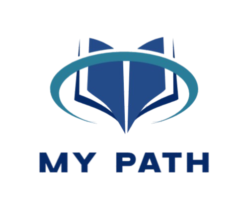

# 🎯 My_path
<p align="center">

</p>
 
<div align = "center">


</div>
An intelligent application designed to help students **find the right educational video** based on a personalized survey. 🎓  
Making learning faster, smarter, and more tailored.
 
---
 
## 🚀 Features
 
- 📋 Survey-based video selection
- 🎯 Personalized recommendations
- 🎨 Clean and intuitive interface
- 🤝 Team collaboration & version control
 
---
 
## 🛠️ Tech Stack
 
### 📝 Documentation
<p align="left">


</p>
 
### 🎨 Design & Development
<p align="left">


</p>
 
### 👥 Collaboration & Version Control
<p align="left">


</p>
 
---
 
## 📄 Documentation
 
- 📘 Project Overview (Word)
- 📊 Presentation Slides (PowerPoint)
 
---
 
## 📦 Installation
 
1. Click the green **`Code`** button on the top right.
2. Or clone the repository using:
 
```
(https://github.com/codingburgas/2425-11-g-pp-student-practices-assignment-team9.git)
```
 
 
## 👨🏻‍💻 Team Members
| **Name**                 | **Role**               |
|--------------------------|------------------------|
| Steliyan Nikolov         | Scrum-trainer          |
| Dimitar Dimov            | Designer               |
| Demetra Karagyozova      | Designer               |
| Viktoria Kupenova        | Developer              |
| Alexandra Zheleva        | Developer              |
